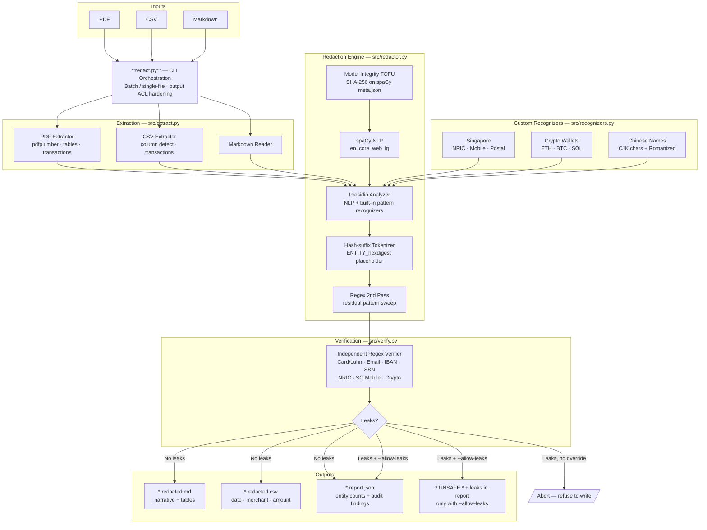

# Architecture

```mermaid
flowchart TD
    subgraph Inputs
        PDF[PDF]
        CSV[CSV]
        MD[Markdown]
    end

    CLI["**redact.py** — CLI Orchestration\nBatch / single-file · output ACL hardening"]

    subgraph Extraction["Extraction — src/extract.py"]
        PDFEXT["PDF Extractor\npdfplumber · tables · transactions"]
        CSVEXT["CSV Extractor\ncolumn detect · transactions"]
        MDEXT["Markdown Reader"]
    end

    subgraph Redaction["Redaction Engine — src/redactor.py"]
        TOFU["Model Integrity TOFU\nSHA-256 on spaCy meta.json"]
        SPACY["spaCy NLP\nen_core_web_lg"]
        PRESIDIO["Presidio Analyzer\nNLP + built-in pattern recognizers"]
        TOKENIZER["Hash-suffix Tokenizer\nENTITY_hexdigest placeholder"]
        REGEX2["Regex 2nd Pass\nresidual pattern sweep"]
    end

    subgraph CustomRec["Custom Recognizers — src/recognizers.py"]
        SG["Singapore\nNRIC · Mobile · Postal"]
        CRYPTO["Crypto Wallets\nETH · BTC · SOL"]
        NAMES["Chinese Names\nCJK chars + Romanized"]
    end

    subgraph Verification["Verification — src/verify.py"]
        VERIFIER["Independent Regex Verifier\nCard/Luhn · Email · IBAN · SSN\nNRIC · SG Mobile · Crypto"]
        DECISION{Leaks?}
    end

    subgraph Outputs
        RMDOUT["*.redacted.md\nnarrative + tables"]
        RCSVOUT["*.redacted.csv\ndate · merchant · amount"]
        REPORT["*.report.json\nentity counts + audit findings"]
        UNSAFE["*.UNSAFE.* + leaks in report\nonly with --allow-leaks"]
    end

    ABORT[/"Abort — refuse to write"/]

    PDF & CSV & MD --> CLI

    CLI --> PDFEXT
    CLI --> CSVEXT
    CLI --> MDEXT

    PDFEXT & CSVEXT & MDEXT --> PRESIDIO

    TOFU --> SPACY
    SPACY --> PRESIDIO
    SG & CRYPTO & NAMES --> PRESIDIO

    PRESIDIO --> TOKENIZER
    TOKENIZER --> REGEX2
    REGEX2 --> VERIFIER

    VERIFIER --> DECISION
    DECISION -- No leaks --> RMDOUT & RCSVOUT & REPORT
    DECISION -- "Leaks + --allow-leaks" --> UNSAFE & REPORT
    DECISION -- "Leaks, no override" --> ABORT
```
